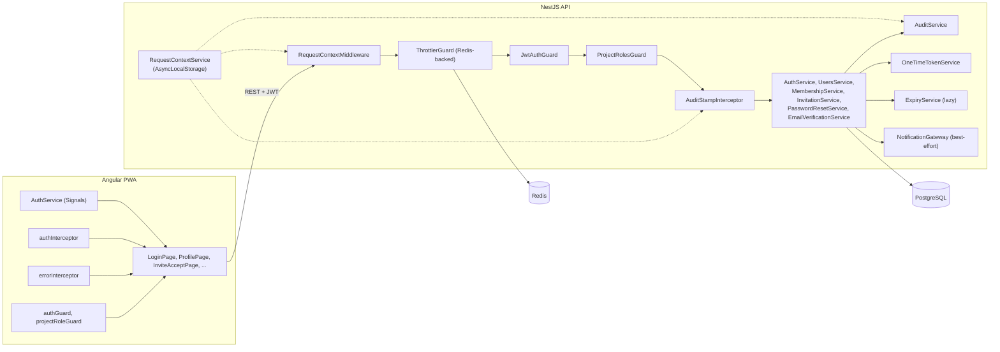

# Unit 1 — Logical Components (NFR Design)

The supporting components introduced/refined to realize Unit 1's NFR design patterns. These sit
alongside the domain components defined in `application-design/components.md` and `component-methods.md`.

## Backend Logical Components

### LC-1 RequestContextService + RequestContextMiddleware
- **Backed by**: `node:async_hooks.AsyncLocalStorage`.
- **Populated by**: `RequestContextMiddleware` (very early in the Nest pipeline).
- **State per request**: `requestId`, `actorUserId | null`, `ip`, `userAgent`, `route`, `now()`.
- **Consumed by**: `AuditStampInterceptor`, `AuditService`, `Logger`, throttler key extractor,
  domain services that need actor identity.
- **Not** populated for non-HTTP origins (demo seed, expiry tick) — those code paths use a `system`
  actor (`actorUserId = null`).

### LC-2 AuditStampInterceptor (Q2=B)
- **Type**: NestJS interceptor (controller layer).
- **Trigger**: methods annotated with metadata `@StampAuditOnRequest()` (or class-level), wrapping
  `INSERT`/`UPDATE`-shaped DTOs.
- **Behavior**:
  - Strips any client-supplied `createdAt/updatedAt/createdBy/updatedBy` (defense in depth on top
    of `ValidationPipe` whitelisting).
  - On insert payloads: sets all four fields from `RequestContext`.
  - On update payloads: sets `updatedAt`, `updatedBy`.
- **Trade-off**: Only HTTP-originated mutations are stamped here; see `AuditStampHelper`.

### LC-3 AuditStampHelper (system-stamping)
- **Type**: stateless helper (`stampSystem`, `stampInsert`, `stampUpdate`).
- **Used by**: demo seed bootstrap, expiry tick, any future scheduled jobs.
- **Sets**: `createdBy = null`, `updatedBy = null`, current timestamps.
- **Why**: Closes the gap left by Q2=B's controller-only interceptor.

### LC-4 AuditService
- **Methods**: `record(change: AuditChange)` — writes a row to `audit_log` (append-only).
  - `AuditChange = { entityType, entityId, action, before?, after?, actorUserId, reason? }`
  - `actorUserId` defaults from `RequestContext` if not supplied.
  - Runs inside the caller's transaction (when present) so the change and its log row commit atomically.
- **Used by** (this build): Unit 5 (review state transitions), Unit 7 (quality score writes /
  reviewer assignment), and any future writers; Unit 1 ships the contract.

### LC-5 ThrottlerModule (Redis-backed) — Q1=B
- **Library**: `@nestjs/throttler` v4. The published `nestjs-throttler-storage-redis` adapter
  targets throttler v5+, so this unit ships a ~30-line custom `RedisStorageService` that
  implements the v4 `ThrottlerStorage` contract directly against `ioredis`.
- **Connection**: `ioredis` to the Docker Compose `redis` service via env (`REDIS_HOST`, `REDIS_PORT`,
  `REDIS_PASSWORD?`).
- **Key extractor**: prefer `RequestContext.actorUserId` when present; else IP. Adds the route name
  to disambiguate per-route limits.
- **Routes covered** (decorator `@Throttle()` on each):
  - `POST /api/v1/auth/login` — 10/min, 30/hr.
  - `POST /api/v1/auth/password/reset/request` — 5/min, 20/hr.
  - `POST /api/v1/invitations/accept` — 10/min, 30/hr.
- **Failure mode**: if Redis is unavailable, the throttler is configured to **fail-open** for local
  demos (logs a warning) so the app still serves requests; in non-local envs this would be flipped
  to fail-closed.

### LC-6 OneTimeTokenService
- **Methods**:
  - `issue(): { cleartext, hash }` — `crypto.randomBytes(32)` URL-safe; `SHA-256` of cleartext.
  - `verify(cleartext, persistedHash): boolean` — constant-time compare.
- **Consumed by**: `LocalAuthService` (password reset), `EmailVerificationService`, `InvitationService`.

### LC-7 ExpiryService (lazy) — Q3=A
- **Type**: stateless helper with one entry point per token type:
  `applyExpiryIfDue(entity)` mutates state to `EXPIRED` (Invitation) or marks the token as invalid
  for use (`PasswordResetToken`/`EmailVerificationToken`) and persists.
- **Called from**: each service's read/use paths (preview, accept, reset-confirm, verify).
- **Tick endpoint** (admin-only, optional): `POST /api/v1/admin/expiry/tick` runs a sweep —
  primarily for tests/PBT and for demo scenarios.

### LC-8 InvitationService / PasswordResetService / EmailVerificationService
- Implement BL-4..BL-8 from `business-logic-model.md`.
- All persistence paths invoke `AuditService.record(...)` on state transitions (Q8=A).

### LC-9 NotificationGateway (Unit 1 stub)
- **Type**: thin wrapper around the (mocked) `NotificationProvider` seam (full module lives in Unit 7).
- **Pattern**: best-effort send (Q4=A). Calls happen *after* DB commit. Failures are logged with
  context (`requestId`, `event`, `recipientMaskedEmail`).
- **In Unit 1** it logs a structured "would-have-emailed" line including the cleartext token URL
  (because we are explicitly mocking delivery for demos).

### LC-10 Auth + RBAC components (refined from Application Design)
- **JwtAuthGuard** (global) — verifies HS256, populates `RequestContext.actorUserId`, attaches
  `AuthUser` to request.
- **ProjectRolesGuard** — looks up the active `ProjectMembership` for `:projectId` and evaluates
  BR-Z2 with the route's allowed-roles metadata.
- **@Roles / @ProjectRoles / @Public / @CurrentUser** — decorators retained from prototype where
  applicable; new `@ProjectRoles(...allowed)` introduced.

### LC-11 RateLimitConfig
- Single Nest provider that resolves limits from env, per route. Hot-swappable from `.env`.

### LC-12 Demo seed bootstrapper (BL-10)
- `OnModuleInit` in `UsersModule` (and a small reconciliation hook for project memberships once
  Unit 3 ships the demo project).
- Uses `AuditStampHelper.stampSystem` for all writes.

## Frontend Logical Components

### FC-1 AuthService
- Signals: `currentUser`, `accessToken`. Persists to `sessionStorage` (NFR-U1-4.4).
- Clears on logout, on `401`, and on tab close (natural).

### FC-2 authInterceptor
- Attaches `Authorization: Bearer <token>` to every request.
- On `401`: clears `AuthService` state and routes to `/login` preserving `redirectTo`.

### FC-3 errorInterceptor
- Maps non-401 errors to user-friendly messages.
- On `5xx`: surfaces a retry prompt (no automatic retry — Q5=A).
- On `403`: routes to a shared "Not authorized" page.

### FC-4 authGuard / projectRoleGuard
- `authGuard` requires authenticated user.
- `projectRoleGuard` reads `data.allowedProjectRoles` and `:projectId`, calls
  `GET /api/v1/projects/:projectId/me-role`, allows if global Admin OR role is in the allowed set.

### FC-5 InviteAcceptPage state machine
- Mirrors BL-5: `loading → invalid|expired|needs-login|needs-account|ready → success|error`.
- Uses Signals; loading/preview separation prevents accidentally consuming the token on initial render.

## Component Diagram (Mermaid)



### Text Alternative
```
Request → RequestContextMiddleware → ThrottlerGuard(Redis) → JwtAuthGuard
       → ProjectRolesGuard → AuditStampInterceptor → Domain services
Domain services → PostgreSQL; AuditService writes audit_log rows
NotificationGateway → mocked provider (logs cleartext token link in demo)
ExpiryService is invoked lazily by Invitation/PasswordReset/EmailVerification services
```

## File Layout (proposed)

```
usgbc-hub-residential-be/src/
├── auth/                            # restructured (existing)
│   ├── guards/jwt-auth.guard.ts
│   ├── guards/project-roles.guard.ts
│   ├── decorators/{public,current-user,roles,project-roles}.decorator.ts
│   ├── local/local-auth.service.ts
│   ├── password-reset/password-reset.service.ts
│   ├── email-verification/email-verification.service.ts
│   ├── auth.controller.ts
│   ├── auth.service.ts
│   └── auth.module.ts
├── users/                           # restructured (existing)
│   ├── user.entity.ts
│   ├── users.controller.ts
│   ├── users.service.ts
│   └── users.module.ts
├── membership/                      # NEW
│   ├── project-membership.entity.ts
│   ├── invitation.entity.ts
│   ├── invitation.service.ts
│   ├── membership.service.ts
│   ├── invitations.controller.ts
│   └── membership.module.ts
├── audit/                           # NEW
│   ├── audit-base.entity.ts         (mixin/abstract)
│   ├── audit-log.entity.ts
│   ├── audit.service.ts
│   ├── audit-stamp.interceptor.ts
│   ├── audit-stamp.helper.ts
│   ├── stamp-audit-on-request.decorator.ts
│   └── audit.module.ts
├── common/
│   ├── request-context/             # NEW
│   │   ├── request-context.middleware.ts
│   │   ├── request-context.service.ts
│   │   └── request-context.module.ts
│   ├── tokens/                      # NEW
│   │   └── one-time-token.service.ts
│   ├── expiry/                      # NEW
│   │   └── expiry.service.ts
│   ├── throttler/                   # NEW
│   │   └── throttler.module.ts      (Redis-backed config)
│   ├── notifications-stub/          # NEW (Unit-1-local stub for U7's seam)
│   │   └── notification.gateway.ts
│   ├── logger/                      (existing)
│   ├── middleware/                  (existing)
│   └── exception/                   (existing)
└── config/                          (existing; extended for REDIS_*, THROTTLE_*, *_TTL)
```

```
usgbc-hub-residential-fe/src/app/
├── core/
│   ├── auth/{auth.service.ts, auth.interceptor.ts, error.interceptor.ts, auth.guard.ts, project-role.guard.ts}
│   ├── api/api-client.ts
│   └── time/now.ts
└── features/auth/
    ├── login/, profile/, password-reset/, verify-email/, invite-accept/
```

## Dependency / Configuration Additions

### Backend `package.json`
- `@nestjs/throttler` (NEW for U1) — v4 to align with Nest 9
- `ioredis` (NEW for U1) — used directly by the custom `RedisStorageService`
- `fast-check` (NEW; PBT framework — also relevant later units)

> The `nestjs-throttler-storage-redis` adapter was originally listed; removed during U1 deploy
> because it pins peer-dep `@nestjs/throttler@>=5`. We implement `ThrottlerStorage` ourselves.

### `docker-compose.yml`
- New `redis:7-alpine` service with healthcheck; backend depends on it.

### `.env.example` (delta)
- `REDIS_HOST=localhost`, `REDIS_PORT=6379`, `REDIS_PASSWORD=`
- `THROTTLE_REDIS_PREFIX=gbci:throttle:`
- `LOCAL_JWT_EXPIRES_IN=8h`, `PASSWORD_RESET_TTL=1h`, `EMAIL_VERIFICATION_TTL=7d`, `INVITATION_TTL=7d`
- Throttle limit envs (per `tech-stack-decisions.md`).
- `FAST_CHECK_RUNS=100`, optional `FAST_CHECK_SEED`.

## Validation
- All NFR requirements have a corresponding pattern or component listed.
- The Q2=B audit-stamping gap (system-originated writes) is closed by `AuditStampHelper`.
- Q1=B's Redis dependency is reflected in stack, env, and Compose deltas.
- PBT properties from Functional Design are reaffirmed in `nfr-design-patterns.md` Q-1.
- No blocking PBT findings at this stage.
