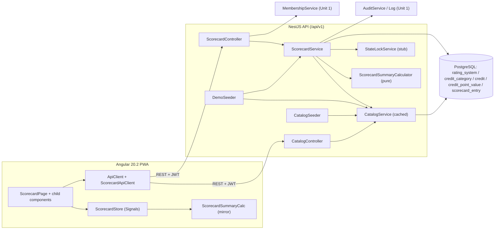

# Unit 2 — Logical Components (NFR Design)

## Backend Logical Components

### LC-1 CatalogModule
- **Provides**: `CatalogService` + the `CatalogSeeder` (`OnModuleInit`).
- **Owns entities**: `RatingSystem`, `CreditCategory`, `Credit`, `CreditPointValue`.
- **Public surface**:
  - `CatalogService.getRatingSystem(idOrSlug)` — cached snapshot (Q14=A).
  - `CatalogService.listRatingSystems()`.
  - `CatalogService.invalidateCache()` — internal; called by the seeder after writes.
- **Controller**: `CatalogController` exposes
  `GET /api/v1/catalog/rating-systems` and `GET /api/v1/catalog/rating-systems/:idOrSlug`.

### LC-2 ScorecardModule
- **Provides**: `ScorecardService` + the controller.
- **Owns entities**: `ScorecardEntry`.
- **Depends on**: `CatalogModule` (for credit metadata + summary calculator), `MembershipModule`
  (for the project-role lookup invoked by `ProjectRolesGuard`), `AuditModule` (for explicit
  `AuditService.record` on `attempted` flips).
- **Public surface**:
  - `ScorecardService.initFor(projectId, ratingSystemId, actor)` — used by Unit 3 / the demo seed.
  - `ScorecardService.getScorecard(projectId)` — entries + summary + warnings.
  - `ScorecardService.getSummary(projectId)` — authoritative summary only.
  - `ScorecardService.toggleAttempted(projectId, creditId, attempted, actor)`.
  - `ScorecardService.unattempt(projectId, creditId, actor)` (BL-7 soft-clear).
  - `ScorecardService.setPoints(projectId, creditId, patch, actor)` — returns entry + warnings.
- **Controller**: `ScorecardController` exposes the endpoints listed in `business-logic-model.md`.

### LC-3 ScorecardSummaryCalculator (pure module)
- Lives at `src/scorecard/calculator/scorecard-summary.calculator.ts`.
- **No** NestJS / TypeORM imports.
- Functions: `compute(entries, catalog)`, `deriveCertificationLevel(awarded, levels)`,
  `validateEntry(entry, credit)`.
- Imported by `ScorecardService.getScorecard / getSummary` and by the demo seed.

### LC-4 CatalogSeeder
- `OnModuleInit` reads `scripts/seed/leed-v41-sf-catalog.json`, validates, upserts.
- Uses `AuditStampHelper.stampSystem*` for system-actor stamping.
- Idempotent.

### LC-5 DemoSeeder (extends Unit 1's demo seed surface)
- Runs after `CatalogSeeder` so the catalog is in place.
- Steps (BL-8):
  1. Insert/update placeholder demo project row.
  2. Reconcile demo memberships via `MembershipService.addMember`.
  3. Initialize the scorecard via `ScorecardService.initFor`.
  4. Apply the curated demo edits (Silver-band scorecard).
- Idempotency rule: only seeds rows where `createdBy` and `updatedBy` are both `null` (system-set);
  user-modified rows are left alone.

### LC-6 StateLockService stub (provided here, replaced in Unit 5)
- A small service with `assertWritable(projectId)` that today is a no-op (Unit 5 will replace it
  with the real `UNDER_REVIEW` check).
- Wired into `ScorecardService` write paths now to keep call sites stable.

## Frontend Logical Components

### FC-1 ScorecardStore
- File: `src/app/features/scorecard/scorecard.store.ts`.
- Signals + computeds described in `frontend-components.md`.
- Persistence: snapshot to `sessionStorage` keyed by `projectId`; revalidates on resume.

### FC-2 ScorecardSummaryCalc (FE mirror)
- File: `src/app/features/scorecard/scorecard-summary.calc.ts`.
- Mirror of LC-3. Annotated with a sync-marker comment.

### FC-3 ScorecardApiClient (extension of `core/api/api-client.ts`)
- Methods: `getCatalog`, `listRatingSystems`, `getScorecard`, `getSummary`, `toggleAttempted`,
  `unattempt`, `setPoints`.

### FC-4 Components
- `ScorecardPage`, `ScorecardSummaryBar`, `ScorecardViewTabs`, `ProjectInfoPanel`, `CategoryRow`,
  `CreditRow`, `PointCell`, `AttemptedToggle` — see `frontend-components.md`.

### FC-5 Confirm-clear dialog
- A small `MatDialog` component used by `AttemptedToggle` when toggling off (BR-S7 / Q5=A).

## Component Diagram (Mermaid)



### Text Alternative

```
ScorecardPage → ScorecardStore → ApiClient → /api/v1/projects/:projectId/scorecard...
ScorecardController → ScorecardService → CatalogService (cached) → DB
ScorecardService → ScorecardSummaryCalculator (pure)
ScorecardService → AuditService.record (on attempted flips)
ScorecardService → StateLockService.assertWritable (no-op until Unit 5)
CatalogSeeder → CatalogService.invalidate + DB upserts
DemoSeeder → CatalogService + ScorecardService (after Unit 1 user seed)
```

## File Layout (proposed)

```
usgbc-hub-residential-be/src/
├── catalog/
│   ├── rating-system.entity.ts
│   ├── credit-category.entity.ts
│   ├── credit.entity.ts
│   ├── credit-point-value.entity.ts
│   ├── catalog.controller.ts
│   ├── catalog.service.ts
│   ├── catalog.seeder.ts
│   ├── dto/{rating-system.dto.ts, credit.dto.ts}
│   └── catalog.module.ts
├── scorecard/
│   ├── scorecard-entry.entity.ts
│   ├── scorecard.controller.ts
│   ├── scorecard.service.ts
│   ├── state-lock.service.ts          (stub; Unit 5 will replace)
│   ├── demo.seeder.ts                  (depends on UsersService + MembershipService)
│   ├── calculator/
│   │   ├── scorecard-summary.calculator.ts
│   │   └── scorecard-warnings.ts
│   ├── dto/{scorecard.dto.ts, set-points.dto.ts, toggle-attempted.dto.ts, scorecard-summary.dto.ts, warning.dto.ts}
│   └── scorecard.module.ts
└── app.module.ts                       (register CatalogModule + ScorecardModule + entities)

scripts/seed/
└── leed-v41-sf-catalog.json            (hand-curated; Q1=C)
```

```
usgbc-hub-residential-fe/src/app/features/scorecard/
├── scorecard.routes.ts
├── scorecard.store.ts
├── scorecard-summary.calc.ts           (mirror of backend pure calculator)
├── api/
│   └── scorecard-api.client.ts
├── scorecard-page/scorecard-page.component.ts
└── components/
    ├── scorecard-summary-bar/...
    ├── scorecard-view-tabs/...
    ├── project-info-panel/...
    ├── category-row/...
    ├── credit-row/...
    ├── point-cell/...
    ├── attempted-toggle/...
    └── confirm-clear-dialog/...
```

## Configuration / Environment

No new env keys for Unit 2.

## Validation
- All Unit 2 NFRs map to a pattern or component listed here.
- Pure calculator (LC-3) is the single source of truth for the scorecard math; FE mirror documents
  the dependency.
- Catalog cache (Q14=A) is realized by `CatalogService` with explicit invalidation by the seeder.
- Last-write-wins (Q13=A) realized by `ScorecardService` writes that increment `version` without
  enforcing a supplied value.
- View-tabs (Q7=A) wired in the FE; no backend support required for the placeholder tabs.
- Demo seed (Q8=A) realized by `LC-5 DemoSeeder` running after `LC-4 CatalogSeeder`.

## PBT Compliance
- PBT-01 / PBT-09 — COMPLIANT (carry-over from Unit 1; calculator properties documented).
- PBT-02..08, PBT-10 — DOCUMENTED DEVIATION (tests skipped). No blocking findings at this stage.
