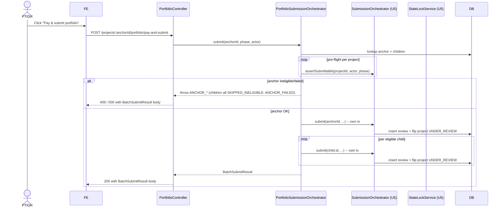

# Unit 6 — Business Logic Model

End-to-end behavior for the Portfolio unit. Decisions reflect the all-A approval of
`unit-6-portfolio-design-plan.md`. PBT-01 properties: **FL-12** hierarchy invariant (pure),
**FL-13** anchor-failure cascade, **FL-14** independent children.

---

## Module map (one new BE module + extensions)

| Component | Kind | Location |
|---|---|---|
| `PortfolioModule` | Nest module | `src/portfolio/portfolio.module.ts` |
| `PortfolioService` | service (anchor + attach + detach + dashboard) | `src/portfolio/portfolio.service.ts` |
| `PortfolioFeeService` | service (combined-fee aggregation) | `src/portfolio/portfolio-fee.service.ts` |
| `PortfolioSubmissionOrchestrator` | service (batch submit) | `src/portfolio/portfolio-submission.orchestrator.ts` |
| `PortfolioController` | controller (anchor PATCH + dashboard GET + submit POST) | `src/portfolio/portfolio.controller.ts` |
| `HierarchyInvariant` | pure module — `assertHierarchy` | `src/portfolio/state-machine/hierarchy.invariant.ts` |
| `PortfolioDashboardDto`, `PortfolioFeeQuoteDto`, `BatchSubmitResultDto`, `PatchAnchorDto`, `PatchParentAnchorDto`, `PortfolioSubmitDto` | DTOs | `src/portfolio/dto/*.ts` |
| `Project` (extended) | column add | `src/projects/project.entity.ts` (already present, plus new `is_portfolio_anchor`) |
| `RegistrationDdlBootstrapper` (extended) | DDL bootstrap | `src/projects/registration-ddl.bootstrapper.ts` (FK + CHECK + INDEX) |
| `SubmissionOrchestrator` (extended) | extracted `assertSubmittable` | `src/review/submission.orchestrator.ts` (refactor only) |

Existing collaborators (no behavior change): `ProjectsService`, `ScorecardEntryRepository`,
`ReviewRepository`, `MembershipService`, `AuditService`, `RequestContextService`, `Logger`,
`FeeCalculator`, `Invoice` repo, `StateLockService`.

---

## Pure subject — HierarchyInvariant (FL-12)

`src/portfolio/state-machine/hierarchy.invariant.ts`:

```ts
export interface HierarchyCandidate {
  id: string;
  isPortfolioAnchor: boolean;
  parentAnchorId: string | null;
}

/**
 * BR-PA2 / BR-PA6 / FL-12.
 *
 * Asserts that `child` may legally adopt `candidateAnchor` as its parent.
 * Throws an `Error` (Nest layer translates to 400 / 409). No I/O.
 *
 * Properties (PBT-01 FL-12):
 *  - Reflexivity: assertHierarchy(p, p) always throws (self-parenting prohibited).
 *  - Anchor-only: when candidate.isPortfolioAnchor === false → throws.
 *  - Depth-1: when candidate.parentAnchorId !== null → throws.
 *  - Idempotence: when child.parentAnchorId === candidate.id and constraints
 *    hold, the call is a no-op (no error).
 */
export function assertHierarchy(
  child: HierarchyCandidate,
  candidateAnchor: HierarchyCandidate | null,
): void {
  if (candidateAnchor === null) return;            // detach is always legal at this layer
  if (candidateAnchor.id === child.id) {
    throw new Error('HIERARCHY_SELF_PARENT');
  }
  if (!candidateAnchor.isPortfolioAnchor) {
    throw new Error('HIERARCHY_TARGET_NOT_ANCHOR');
  }
  if (candidateAnchor.parentAnchorId !== null) {
    throw new Error('HIERARCHY_DEPTH_EXCEEDED');
  }
  if (child.isPortfolioAnchor) {
    throw new Error('HIERARCHY_ANCHOR_CANNOT_BE_CHILD');
  }
}
```

PBT-01 setup: arbitrary `HierarchyCandidate` × `HierarchyCandidate` pairs (`fast-check` `fc.record`
with bounded UUIDs). Properties enumerated in the JSDoc above.

---

## Flow 1 — Designate / un-designate anchor (US-5.1, BR-PA1, BR-PA3, BR-PA4)

`PATCH /projects/:projectId/anchor` body `{ isPortfolioAnchor: boolean }`.

```
PortfolioController.toggleAnchor(projectId, dto, actor)
 ├─ ProjectRolesGuard: PT/GR on project OR global Admin → else 403
 ├─ stateLock.assertWritable(projectId, actor)        // U5 guard, blocks during UNDER_REVIEW
 ├─ projectsService.getById(projectId)
 ├─ if project.isPortfolioAnchor === dto.isPortfolioAnchor → 200 idempotent (no audit)
 ├─ if dto.isPortfolioAnchor === false:
 │    ├─ portfolioService.assertCanUnanchor(projectId)  // BR-PA3 (children check)
 │    │                                                 // BR-PA4 (PORTFOLIO_BUSY check)
 ├─ if dto.isPortfolioAnchor === true:
 │    ├─ if project.parentAnchorId !== null → 409 ANCHOR_HAS_PARENT  (BR-PA2)
 ├─ project.isPortfolioAnchor = dto.isPortfolioAnchor
 ├─ project.version += 1; AuditStampHelper.stampUpdate(project, actor.userId)
 ├─ projectsRepo.save(project)
 └─ AuditService.record({ entityType: 'Project.anchor', entityId, action: UPDATE,
                          actorUserId, before, after })
```

Errors: `403 FORBIDDEN`, `409 ANCHOR_HAS_CHILDREN`, `409 ANCHOR_HAS_PARENT`,
`409 PORTFOLIO_BUSY`.

---

## Flow 2 — Attach / detach child (US-5.1, BR-PA5, BR-PA6)

`PATCH /projects/:childId/parent-anchor` body `{ parentAnchorId: string | null }`.

```
PortfolioController.setParentAnchor(childId, dto, actor)
 ├─ ProjectRolesGuard: PT/GR on child OR global Admin → else 403
 ├─ stateLock.assertWritable(childId, actor)
 ├─ child = projectsService.getById(childId)
 ├─ if dto.parentAnchorId === null:
 │    ├─ child.parentAnchorId = null
 │    ├─ persist + audit                                // BR-PA5
 │    └─ return 200
 ├─ candidate = projectsService.getById(dto.parentAnchorId)
 ├─ assertHierarchy(child, candidate)                  // FL-12 / BR-PA6
 │   on Error('HIERARCHY_*') → 409 with code; details in problem-json body
 ├─ child.parentAnchorId = candidate.id
 ├─ child.version += 1; AuditStampHelper.stampUpdate(child, actor.userId)
 ├─ projectsRepo.save(child)
 └─ AuditService.record({ entityType: 'Project.parentAnchor', entityId: childId, action: UPDATE,
                          actorUserId, before, after })
```

Forward-compat: when later we want to enforce "child must be REGISTERED before attaching to a
paid anchor's batch," that check goes here as a new BR-PA rule. Not enforced this build.

---

## Flow 3 — Portfolio dashboard read (US-5.2, BR-PM2)

`GET /projects/:anchorId/portfolio` (no body).

```
PortfolioController.getDashboard(anchorId, actor)
 ├─ ProjectRolesGuard: any membership on anchor OR global Admin → else 403
 ├─ portfolioService.buildDashboard(anchorId)
 │   ├─ anchor = projectsRepo.findOneOrFail(anchorId)
 │   ├─ if !anchor.isPortfolioAnchor → 409 NOT_AN_ANCHOR
 │   ├─ children = projectsRepo.find({ parentAnchorId: anchorId })
 │   │             .order('gbciDisplayId', 'ASC NULLS LAST')
 │   ├─ for each (anchor + children):
 │   │   ├─ scorecard rollup: SELECT SUM(awardedPoints), SUM(verifiedPoints) FROM scorecard_entry
 │   │   │                    WHERE projectId = $1 AND attempted = true
 │   │   ├─ latestReview: SELECT * FROM review WHERE projectId = $1
 │   │   │                ORDER BY phase DESC, submittedAt DESC LIMIT 1
 │   ├─ rollup = aggregate(children)
 │   └─ return PortfolioDashboard{ anchor, children, rollup }
 └─ return 200
```

Notes:
- Two queries per project for the rollup (scorecard + latestReview). Acceptable for ≤50
  children. Future: collapse into a single `LEFT JOIN LATERAL` when sizes grow.
- The endpoint is read-only; no audit row.

---

## Flow 4 — Portfolio fee quote (US-5.3, BR-PF1)

`GET /projects/:anchorId/portfolio/fee-quote?phase=PRELIMINARY`.

```
PortfolioController.feeQuote(anchorId, phase, actor)
 ├─ ProjectRolesGuard: any membership on anchor OR Admin → else 403
 ├─ portfolioFeeService.quote(anchorId, phase)
 │   ├─ anchor + children = same look-up as Flow 3
 │   ├─ for each project:
 │   │   ├─ paidInvoice? = invoiceRepo.findOne({ projectId, paidAt: Not(IsNull()) })
 │   │   ├─ registrationFeeCents =
 │   │   │     paidInvoice ? 0 : feeCalculator.compute({ ratingSystemSlug, membershipLevel, schedule, now }).totalCents
 │   │   ├─ reviewFeeCents = 0   // deferred
 │   │   └─ lineItems.push({ projectId, registrationFeeCents, reviewFeeCents, totalCents, warnings })
 │   ├─ totals = sum(lineItems)
 │   └─ return PortfolioFeeQuote{ anchorProjectId, phase, lineItems, totals, warnings }
 └─ return 200
```

PBT-01 note: `FeeCalculator.compute` is already covered by U3's FL-1 properties (deterministic,
member-monotonic, missing-schedule fallback). The portfolio aggregation adds no new properties
worth a separate property test (it's straight summation).

---

## Flow 5 — Batch submit (US-7.2, BR-BS1..BR-BS8, FL-13, FL-14)

`POST /projects/:anchorId/portfolio/submit` body `{ phase: ReviewPhase }`.

```
PortfolioController.batchSubmit(anchorId, dto, actor)
 ├─ ProjectRolesGuard: PT/GR on anchor OR Admin → else 403   (BR-BS7)
 └─ portfolioSubmissionOrchestrator.submit(anchorId, dto.phase, actor)
     │
     ├── 1. Resolve portfolio
     │     anchor + children = projectsRepo lookup
     │     if !anchor.isPortfolioAnchor → 409 NOT_AN_ANCHOR
     │
     ├── 2. Pre-flight (no DB writes)
     │     for each project (anchor first, children sorted):
     │       try await submissionOrchestrator.assertSubmittable(projectId, actor, phase)
     │       on success → eligible
     │       on known errors → map to SkipReason  (BR-BS4)
     │
     ├── 3. Anchor decision  (BR-BS1, BR-BS2, FL-13)
     │     if !anchor.eligible:
     │       result = {
     │         anchor: { status: 'ANCHOR_INELIGIBLE', reason },
     │         children: [...all children: { status: 'SKIPPED_INELIGIBLE', reason: 'ANCHOR_FAILED' }],
     │         summary: { submittedCount: 0, skippedCount: 1 + children.length, failedCount: 0 }
     │       }
     │       audit('PortfolioBatch.submit', anchorId, summary)
     │       throw new ConflictException(buildProblem('ANCHOR_INELIGIBLE', result))
     │
     ├── 4. Anchor submit  (BR-BS1)
     │     try {
     │       const review = await submissionOrchestrator.submit(anchorId, phase, actor)
     │       anchorOutcome = { status: 'SUBMITTED', reviewId: review.id, reviewDisplayId: review.displayId }
     │     } catch (err) {
     │       result.anchor = { status: 'ANCHOR_FAILED', error: { code, message } }
     │       result.children = [...all children: { status: 'SKIPPED_INELIGIBLE', reason: 'ANCHOR_FAILED' }]   // FL-13
     │       audit('PortfolioBatch.submit', anchorId, summary)
     │       throw new InternalServerErrorException(buildProblem('ANCHOR_FAILED', result))
     │     }
     │
     ├── 5. Children submit  (BR-BS3, FL-14)
     │     for each child (sequential, sorted by gbciDisplayId asc, NULLs last):
     │       if !child.eligible:
     │         result.children.push({ status: 'SKIPPED_INELIGIBLE', reason })
     │         continue
     │       try {
     │         const review = await submissionOrchestrator.submit(child.id, phase, actor)
     │         result.children.push({ status: 'SUBMITTED', reviewId, reviewDisplayId })
     │       } catch (err) {
     │         result.children.push({ status: 'FAILED', error: { code: err.code ?? 'CHILD_SUBMIT_FAILED', message: err.message } })
     │       }
     │       audit('PortfolioBatch.child', child.id, outcome)
     │
     └── 6. Summarize + audit batch
           audit('PortfolioBatch.submit', anchorId, summary)
           return result
```

PBT-01 setup for **FL-13** and **FL-14** (test subjects, even though tests are deferred per
the documented PBT deviation):
- **FL-13** harness: stub `SubmissionOrchestrator.assertSubmittable` to throw for the anchor;
  generate arbitrary children fixtures; assert the result satisfies
  `result.children.every(c => c.status !== 'SUBMITTED')`.
- **FL-14** harness: anchor passes; children fixtures are a list of independent (eligible /
  ineligible / failing) cases; assert each child's outcome equals the outcome predicted by its
  own fixture, regardless of siblings' fixtures.

---

## Flow 6 — Pay & submit portfolio together (US-5.3, BR-PF2, BR-PF3)

`POST /projects/:anchorId/portfolio/pay-and-submit` body `{ phase, paymentMethod? }`.

```
PortfolioController.payAndSubmit(anchorId, dto, actor)
 ├─ ProjectRolesGuard: PT/GR on anchor OR Admin → else 403
 ├─ quote = portfolioFeeService.quote(anchorId, dto.phase)
 ├─ if quote.totals.totalCents === 0:                       // BR-PF2 (the realistic path)
 │     return portfolioSubmissionOrchestrator.submit(anchorId, dto.phase, actor)
 ├─ else:                                                    // BR-PF2 forward-compat
 │     throw new NotImplementedException(
 │       'PORTFOLIO_COMBINED_PAYMENT_NOT_IMPLEMENTED — use per-project pay flow then portfolio submit'
 │     )
```

The `else` branch is intentional and explicit. It means: in this build, the only realistic
combined-pay path is the $0 path (registration already paid; review fees deferred). The
non-zero path is documented forward-compat work; a clear error is preferable to a half-baked
"creates per-project invoices in a loop" that would muddle the audit trail.

---

## Flow 7 — `SubmissionOrchestrator.assertSubmittable` extraction (BR-BS6)

The U5 `SubmissionOrchestrator.submit(...)` body has these checks inline:
1. `await this.reviews.assertSubmitter(projectId, actor)`
2. `project.status !== ProjectStatus.REGISTERED → ConflictException`
3. `assertPhaseOrdering(...)`
4. `attemptedCount === 0 → BadRequestException`
5. `existing && existing.status !== RETURNED → ConflictException`

Extraction:
- New private `validateSubmittable(projectId, phase, actor)` runs steps 1-5; returns the
  prefetched `project` + `existing` to avoid a second round-trip.
- New public `assertSubmittable(projectId, phase, actor): Promise<void>` calls the private and
  discards the return value.
- `submit(...)` calls the private at the top of its body and reuses the prefetched values.

Mapping to `SkipReason` (used by the portfolio orchestrator):
| Inline error | SkipReason |
|---|---|
| `ConflictException('Project must be REGISTERED ...')` | `WRONG_PROJECT_STATUS` |
| `BadRequestException('... at least one attempted credit ...')` | `NO_ATTEMPTED_CREDIT` |
| `ConflictException('... requires a returned Preliminary review ...')` (and SUPPLEMENTAL variant) | `PHASE_ORDERING` |
| `ConflictException('... already in progress ...')` | `REVIEW_IN_PROGRESS` |
| `ForbiddenException` from `reviews.assertSubmitter` | `NO_MEMBERSHIP` |
| (anything else) | falls through to `status: 'FAILED'` with raw message |

The mapper lives in the portfolio orchestrator (`mapSubmitErrorToSkip(err): SkipReason | null`).

---

## Sequencing across modules (Mermaid)



Text alternative: the controller delegates to the orchestrator. The orchestrator walks anchor
first; on anchor failure it short-circuits with all-children-skipped. On anchor success it
walks each child sequentially, capturing per-child outcomes. State-lock flips on each
successful submit and is enforced by U5's `StateLockService` against later writes.

---

## State-lock interplay (BR-Z carry-forward)

| Write | Blocked when project is UNDER_REVIEW? | Notes |
|---|---|---|
| Toggle `is_portfolio_anchor` | Blocked for PT/GR; Admin allowed. | `assertWritable` is called. |
| Set `parent_anchor_id` (attach/detach) | Blocked for PT/GR; Admin allowed. | Same. |
| Read dashboard | Never blocked. | Reads bypass `assertWritable`. |
| Batch submit | Initial write per project; uses U5 `submit` which itself flips status. | Children already in UNDER_REVIEW would be picked up as `REVIEW_IN_PROGRESS` via `existing` check inside `assertSubmittable`. |

---

## Read paths (no audit, no orchestration)

| Endpoint | Returns | RBAC |
|---|---|---|
| `GET /projects/:anchorId/portfolio` | `PortfolioDashboard` | any project member on anchor OR Admin |
| `GET /projects/:anchorId/portfolio/fee-quote?phase=...` | `PortfolioFeeQuote` | any project member on anchor OR Admin |

---

## Testable properties (PBT-01)

> Tests remain skipped per the U1 PBT deviation. Subjects are written test-friendly so that
> when tests are turned back on, the harnesses are straightforward.

| ID | Subject | Property |
|---|---|---|
| FL-12 | `assertHierarchy(child, candidate)` (pure) | Self-parenting throws; non-anchor target throws; depth>1 target throws; null candidate is no-op; valid candidate passes idempotently. |
| FL-13 | `PortfolioSubmissionOrchestrator.submit` | When the anchor is ineligible OR throws, `result.children.every(c => c.status !== 'SUBMITTED')`. |
| FL-14 | `PortfolioSubmissionOrchestrator.submit` | Each child's outcome is a function of `(child fixture, actor, phase)` alone — independent of siblings. |
