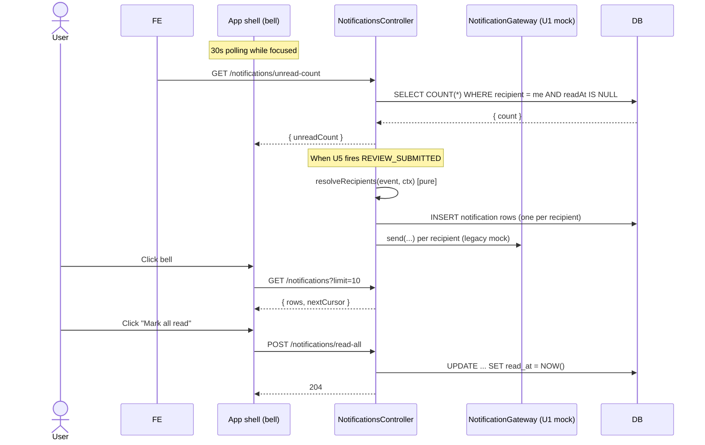

# Unit 7 — Business Logic Model

End-to-end behavior for the Dashboards & Notifications unit. Decisions reflect the all-A
approval of `unit-7-dashboards-notifications-design-plan.md`. PBT-01 properties: **FL-15**
recipient fan-out (pure), **FL-16** unread-count, **FL-17** pipeline-filter idempotence (pure).

---

## Module map

| Component | Kind | Location |
|---|---|---|
| `NotificationsModule` | Nest module | `src/notifications/notifications.module.ts` |
| `NotificationsService` | service (fire + persist + list + read) | `src/notifications/notifications.service.ts` |
| `NotificationsController` | controller (4 routes) | `src/notifications/notifications.controller.ts` |
| `Notification` entity | TypeORM entity | `src/notifications/notification.entity.ts` |
| `NotificationKind` enum | enum | `src/notifications/enums/notification.enums.ts` |
| `RecipientResolver` | pure module — `resolveRecipients` | `src/notifications/recipients/recipient-resolver.ts` |
| `BodyMarkdownBuilder` | pure module — body+link composition | `src/notifications/recipients/body-markdown.builder.ts` |
| `AdminPipelineService` | service (admin pipeline aggregation) | `src/admin/pipeline/admin-pipeline.service.ts` |
| `AdminPipelineController` | controller | `src/admin/pipeline/admin-pipeline.controller.ts` |
| `PipelineFilter` | pure module — `applyPipelineFilters` | `src/admin/pipeline/pipeline-filter.ts` |
| `AdminModule` | Nest module | `src/admin/admin.module.ts` |
| `DashboardsService` | service (PT + GR + Reviewer aggregations) | `src/dashboards/dashboards.service.ts` |
| `DashboardsController` | controller | `src/dashboards/dashboards.controller.ts` |
| `DashboardsModule` | Nest module | `src/dashboards/dashboards.module.ts` |
| `ReviewerDashboardController` extension | new route on existing `ReviewModule` | `src/review/review.controller.ts` (`@Get('reviews/assigned')`) |

Existing collaborators (no behavior change): `ProjectsService`, `MembershipService`,
`ReviewService`, `ScorecardEntry` repo, `Invoice` repo, `CertificationAgreement` repo,
`PortfolioService` (read-only consumer), `AuditService`, `Logger`, `RequestContextService`,
`UsersService` (for resolving emails), `NotificationGateway` (U1 mock — preserved).

---

## Pure subject — RecipientResolver (FL-15)

`src/notifications/recipients/recipient-resolver.ts`:

```ts
import { ProjectRole } from '../../auth/enums/role.enum';

export interface NotificationEvent {
  kind: NotificationKind;
  context: Record<string, unknown>;
}

export interface ProjectMember {
  userId: string;
  projectRole: ProjectRole;
  email: string;
}

export interface RecipientResolutionContext {
  projectMembers: Record<string, ProjectMember[]>;
  projectOwnerEmails?: Record<string, string | null>;
  resolvedUsers?: Record<string, { userId: string; email: string }>;
}

export interface RecipientPlan {
  recipients: Array<{ userId: string; email: string | null; eventKey: string }>;
}

export function resolveRecipients(
  event: NotificationEvent,
  ctx: RecipientResolutionContext,
): RecipientPlan {
  switch (event.kind) {
    case NotificationKind.INVITATION_SENT:
      return resolveInvitation(event, ctx);
    case NotificationKind.REGISTRATION_CONFIRMED:
      return resolveRegistration(event, ctx);
    case NotificationKind.REVIEW_SUBMITTED:
    case NotificationKind.REVIEW_RETURNED:
      return resolveReviewLifecycle(event, ctx);
    case NotificationKind.PORTFOLIO_BATCH_COMPLETED:
      return resolvePortfolioBatch(event, ctx);
    case NotificationKind.REVIEWER_ASSIGNED:
      return resolveReviewerAssigned(event, ctx);
  }
}
```

Per-kind helpers (all pure):
- `resolveInvitation` — invited user only when `ctx.resolvedUsers['invitee']` is present.
  Returns `{ recipients: [] }` otherwise (the U1 mock email still fires).
- `resolveRegistration` — distinct PT/GR members of `event.context.projectId` plus the
  project's owner email if it resolves to a user (via `ctx.resolvedUsers['owner']`).
- `resolveReviewLifecycle` — distinct PT/GR members of `event.context.projectId`.
- `resolvePortfolioBatch` — distinct PT/GR members of `event.context.anchorProjectId`.
- `resolveReviewerAssigned` — only `ctx.resolvedUsers['reviewer']`.

`eventKey` formula:
- `INVITATION_SENT` → `'invitation:<invitationId>:<userId>'`
- `REGISTRATION_CONFIRMED` → `'registration:<projectId>:<userId>'`
- `REVIEW_SUBMITTED` → `'review-submitted:<reviewId>:<userId>'`
- `REVIEW_RETURNED` → `'review-returned:<reviewId>:<userId>'`
- `PORTFOLIO_BATCH_COMPLETED` → `'portfolio-batch:<anchorProjectId>:<phase>:<firedAt-second>:<userId>'`
- `REVIEWER_ASSIGNED` → `'reviewer-assigned:<projectId>:<userId>'`

PBT-01 setup for FL-15: arbitrary `(NotificationEvent, RecipientResolutionContext)` pairs;
property: the resolved recipient set equals the per-kind rule's expected set (no false
positives, no false negatives), with no duplicates and stable `eventKey`s.

---

## Pure subject — PipelineFilter (FL-17)

`src/admin/pipeline/pipeline-filter.ts`:

```ts
export interface PipelineFilterInput {
  status?: ProjectStatus;
  phase?: ReviewPhase;
  assignedReviewerId?: string;
  gbciDisplayIdContains?: string;
}

export function applyPipelineFilters<T extends PipelineRowDto>(
  rows: T[],
  filter: PipelineFilterInput,
): T[] {
  return rows.filter((row) => {
    if (filter.status && row.status !== filter.status) return false;
    if (filter.phase && row.latestReview?.phase !== filter.phase) return false;
    if (filter.assignedReviewerId && row.assignedReviewer?.userId !== filter.assignedReviewerId) return false;
    if (filter.gbciDisplayIdContains) {
      const needle = filter.gbciDisplayIdContains.toLowerCase();
      const hay = (row.gbciDisplayId ?? '').toLowerCase();
      if (!hay.includes(needle)) return false;
    }
    return true;
  });
}
```

PBT-01 setup for FL-17: arbitrary `(rows, filterA, filterB)` triples; property:
`applyPipelineFilters(rows, mergeFilters(A, B)).length ≤ applyPipelineFilters(rows, A).length`
AND every row in `applyPipelineFilters(rows, mergeFilters(A, B))` is also in
`applyPipelineFilters(rows, A) ∩ applyPipelineFilters(rows, B)`. (Adding a filter is monotone
— never increases the result set.)

The BE uses this same predicate inside the SQL `WHERE` clause for performance; the pure
function is exposed for testability and for FE-side echo.

---

## Flow 1 — Fire a notification (US-7.8, BR-N1, BR-N3, BR-N4)

```
NotificationsService.fire(event, partialCtx)
 ├─ ctx = await resolveContext(event, partialCtx)
 │   ├─ project members lookup if event references a projectId
 │   ├─ owner email lookup
 │   └─ resolved-user lookups (invitee, reviewer)
 ├─ plan = resolveRecipients(event, ctx)            // pure FL-15 subject
 ├─ deduped = uniqueByEventKey(plan.recipients)     // BR-N4 in-memory
 ├─ for each r in deduped:
 │     compose subject + bodyMarkdown + link via BodyMarkdownBuilder (pure)
 │     await notificationRepo.save({ kind, recipientUserId, subject, bodyMarkdown,
 │                                   context, link, recipientEmail, firedAt: now })
 ├─ for each r in deduped:
 │     await notificationGateway.send({ kind, to: r.email, subject, context })  // U1 backward-compat
 └─ when plan.recipients is empty:
       continue calling notificationGateway.send for the originating event
```

Call-site migration:
| Existing call site | Migrates to |
|---|---|
| `InvitationService.send(...)` (U1) | `notificationsService.fire({ kind: 'INVITATION_SENT', context: { projectId, invitationId, projectRole, expiresAt } })` |
| `RegistrationOrchestrator` confirmation send (U3) | `fire({ kind: 'REGISTRATION_CONFIRMED', context: { projectId, displayProjectId, invoiceDisplayId, totalCents } })` |
| `SubmissionOrchestrator.submit` (U5) | `fire({ kind: 'REVIEW_SUBMITTED', context: { projectId, reviewId, reviewDisplayId, phase } })` |
| `ReviewOrchestrator.return` (U5) | `fire({ kind: 'REVIEW_RETURNED', context: { projectId, reviewId, reviewDisplayId, phase, outcome } })` |
| `ReviewerAssignmentService.assign` (U5) | `fire({ kind: 'REVIEWER_ASSIGNED', context: { projectId, displayProjectId, projectName } })` (with `resolvedUsers.reviewer`) |
| `PortfolioSubmissionOrchestrator.submit` (U6) | After successful or partial batch: `fire({ kind: 'PORTFOLIO_BATCH_COMPLETED', context: { anchorProjectId, phase, summary } })` |

The U1 `NotificationGateway` is **not** removed. It continues to log to console and is kept
behind the persistence layer to preserve forward-compat for real delivery.

---

## Flow 2 — List my notifications + mark read (US-7.8, BR-N5, BR-N6)

`GET /api/v1/notifications?limit=20&cursor=<opaque>`:

```
NotificationsController.list(limit, cursor, actor)
 ├─ ProjectRolesGuard skipped — actor-scoped via @CurrentUser only
 ├─ const rows = await notificationsService.listForRecipient(actor.userId, limit, cursor)
 │     SELECT * FROM notification
 │     WHERE recipient_user_id = :actor
 │       AND (cursor IS NULL OR (fired_at, id) < (:cursorFiredAt, :cursorId))
 │     ORDER BY fired_at DESC, id DESC
 │     LIMIT :limit + 1
 ├─ nextCursor = encodeCursor(rows[limit]) if rows.length > limit else null
 └─ return { rows: rows.slice(0, limit).map(toDto), nextCursor }
```

`POST /api/v1/notifications/:id/read`:

```
notificationsService.markRead(id, actor)
 ├─ row = await repo.findOne({ id, recipientUserId: actor })  // 404 when not found
 ├─ if row.readAt is null:
 │     row.readAt = now
 │     row.version += 1
 │     repo.save(row)
 └─ return toDto(row)
```

`POST /api/v1/notifications/read-all`:

```
UPDATE notification SET read_at = NOW(), version = version + 1
WHERE recipient_user_id = :actor AND read_at IS NULL
```

`GET /api/v1/notifications/unread-count`:

```
SELECT COUNT(*) FROM notification
WHERE recipient_user_id = :actor AND read_at IS NULL
```

PBT-01 setup for FL-16: arbitrary sequences of `fire`/`markRead`/`markAllRead`; assert
`unreadCount` matches `count(notifications WHERE recipient = u AND readAt IS NULL)` after
each step. Subject is a wrapper that simulates the in-memory state (the harness can use the
same TypeORM repo against an in-memory SQLite for fast-check determinism — when tests are
re-enabled).

---

## Flow 3 — Project dashboard (US-10.1, BR-DH2)

`GET /api/v1/dashboards/project`:

```
DashboardsService.buildProjectDashboard(actor)
 ├─ projects = SELECT * FROM project p
 │             JOIN project_memberships pm ON pm.project_id = p.id
 │             WHERE pm.user_id = :actor
 │               AND pm.project_role = 'PROJECT_TEAM'
 │               AND pm.revoked_at IS NULL AND pm.accepted_at IS NOT NULL
 │             ORDER BY p.created_at DESC
 ├─ for each project:
 │     // Reuse PortfolioService aggregations for consistency.
 │     attemptedTotal, awardedTotal = scorecard rollup
 │     latestReview = SELECT FROM review ORDER BY phase DESC, submitted_at DESC LIMIT 1
 │     agreement = SELECT FROM certification_agreement WHERE project_id = :id
 │     invoice = SELECT FROM invoice WHERE project_id = :id
 │     outstandingActions = computeOutstandingActions(project, latestReview, agreement, invoice, attempted, awarded)
 └─ return { items: [{ project, attemptedTotal, awardedTotal, outstandingActions, latestReview }] }
```

`computeOutstandingActions` is a pure helper applying the BR-DH2 priority rules. It does
NOT call out for additional data — its inputs are already on the per-project record.

---

## Flow 4 — Green Rater dashboard (US-10.2, BR-DH3)

```
DashboardsService.buildGreenRaterDashboard(actor)
 ├─ same project lookup but with project_role = 'GREEN_RATER'
 ├─ for each project:
 │     base = same as project dashboard
 │     workbookProgress = compute via 4 SQL aggregations:
 │         creditsAttempted = COUNT(scorecard_entry WHERE attempted = true)
 │         creditsWithSubmittal = COUNT(DISTINCT credit_id) where submittal exists
 │         creditsWithGreenRaterNote = COUNT(DISTINCT credit_id) where verification_note.column = GREEN_RATER and body IS NOT NULL
 │         totalAttempted = COUNT(scorecard_entry WHERE attempted = true)
 │     latestQualityScore = latest submittal_quality_score for the project
 └─ return GreenRaterDashboardDto
```

---

## Flow 5 — Reviewer dashboard (US-10.3, BR-DH4)

`GET /api/v1/reviews/assigned`:

```
ReviewerDashboardEndpoint(actor)
 ├─ is admin? all reviews : reviews on projects where actor has REVIEWER membership
 ├─ for each review:
 │     project summary, scorecard rollup, latest quality score
 ├─ group by review.status ∈ {OPEN, SUBMITTED, DECIDED, CONFIRMED, RETURNED}
 │     each group sorted by submittedAt DESC
 └─ return ReviewerDashboardDto
```

This route is added on the **existing** `ReviewController` (the `@Controller({ path:
'projects/:projectId', version: '1' })` won't host it because there's no projectId — instead
add a sibling controller `ReviewerDashboardController` at path `reviews` so the route is
`GET /api/v1/reviews/assigned`).

---

## Flow 6 — Admin pipeline (US-10.4, BR-AP1, BR-AP2, BR-AP3)

`GET /api/v1/admin/pipeline?status=&phase=&assignedReviewerId=&gbciDisplayIdContains=&limit=&cursor=`:

```
AdminPipelineService.list(filter, limit, cursor)
 ├─ applyFilters builds a TypeORM QueryBuilder:
 │     SELECT p.*, lr.*, lqs.*, ar.*
 │     FROM project p
 │     LEFT JOIN LATERAL (
 │       SELECT r.* FROM review r
 │       WHERE r.project_id = p.id
 │       ORDER BY r.phase DESC, r.submitted_at DESC LIMIT 1
 │     ) lr ON true
 │     LEFT JOIN LATERAL (
 │       SELECT s.* FROM submittal_quality_score s
 │       WHERE s.project_id = p.id
 │       ORDER BY s.entered_at DESC LIMIT 1
 │     ) lqs ON true
 │     LEFT JOIN LATERAL (
 │       SELECT pm.user_id FROM project_memberships pm
 │       WHERE pm.project_id = p.id AND pm.project_role = 'REVIEWER'
 │         AND pm.revoked_at IS NULL AND pm.accepted_at IS NOT NULL
 │       LIMIT 1
 │     ) ar ON true
 │     LEFT JOIN user u ON u.id = ar.user_id
 │     WHERE 1=1
 │       AND (filter.status IS NULL OR p.status = filter.status)
 │       AND (filter.phase IS NULL OR lr.phase = filter.phase)
 │       AND (filter.assignedReviewerId IS NULL OR ar.user_id = filter.assignedReviewerId)
 │       AND (filter.gbciDisplayIdContains IS NULL OR p.gbci_display_id ILIKE '%' || filter.gbciDisplayIdContains || '%')
 │       AND (cursor IS NULL OR (p.created_at, p.id) < (cursorCreatedAt, cursorId))
 │     ORDER BY p.created_at DESC, p.id DESC
 │     LIMIT :limit + 1
 ├─ rows = aggregations + scorecard rollup per project
 ├─ nextCursor = rows[limit] ? encode(rows[limit]) : null
 └─ return AdminPipelinePageDto
```

The pure `applyPipelineFilters(rows, filter)` from FL-17 is used as a **sanity check** in
the service (the SQL is the source of truth, the pure function is defensive — if the SQL
clause and the pure function disagree on a row, the service logs a warning and trusts the
pure function. This matters for FE-side echo where the FE might apply local filtering.)

---

## Flow 7 — Reviewer assignment (US-10.4) — wires existing U5 endpoint

The admin pipeline page exposes an "Assign reviewer" action per project. The FE calls the
existing U5 `POST /api/v1/projects/:projectId/reviewers` endpoint with `{ userId }`. After
success, the FE refetches the pipeline row + fires the new `REVIEWER_ASSIGNED` notification
event server-side (already added to the U5 `ReviewerAssignmentService.assign` per the
call-site migration table above).

---

## Flow 8 — Admin quality-score revise (US-10.5) — wires existing U5 endpoint

Same pattern as Flow 7 — the FE calls the existing U5 `PUT /api/v1/projects/:projectId/
reviews/:reviewId/quality-score` endpoint. The U5 `QualityScoreService.upsert` already
accepts Admin (BR-QS3) and audit-records the revision via `AuditService.record`. No BE
change.

---

## Sequencing across modules (Mermaid)



Text alternative: the bell polls `/notifications/unread-count` every 30 s while the tab is
focused; opening the bell loads the most recent rows; "Mark all read" issues a batch update.
When U1/U3/U5/U6 fire `NotificationsService.fire`, the service computes recipients via the
pure resolver, persists per-recipient rows, and fires the legacy U1 mock for backward compat.

---

## State-lock interplay (BR-Z carry-forward)

| Write | Blocked when project is UNDER_REVIEW? | Notes |
|---|---|---|
| `markRead` / `markAllRead` | Never. | Notifications are user-scoped writes, not project writes. |
| `assignReviewer` (U5) | Admin always passes. | Existing U5 behavior unchanged. |
| Edit quality score (U5) | Admin always passes. | Existing U5 behavior unchanged. |

---

## Read paths

| Endpoint | Returns | RBAC |
|---|---|---|
| `GET /notifications?limit=&cursor=` | `{ rows, nextCursor }` | actor-scoped |
| `GET /notifications/unread-count` | `{ unreadCount }` | actor-scoped |
| `POST /notifications/:id/read` | 204 | actor-scoped (404 if not theirs) |
| `POST /notifications/read-all` | 204 | actor-scoped |
| `GET /dashboards/project` | `ProjectDashboardDto` | any authenticated user |
| `GET /dashboards/green-rater` | `GreenRaterDashboardDto` | any authenticated user (filters server-side) |
| `GET /reviews/assigned` | `ReviewerDashboardDto` | any authenticated user (filters server-side); Admin sees all |
| `GET /admin/pipeline` | `AdminPipelinePageDto` | Admin only |

---

## Testable properties (PBT-01)

> Tests remain skipped per the U1 PBT deviation. Subjects are written test-friendly so that
> when tests are turned back on, the harnesses are straightforward.

| ID | Subject | Property |
|---|---|---|
| FL-15 | `resolveRecipients(event, ctx)` (pure) | For every input event + ctx, the recipient set equals the per-kind rule's expected set; no duplicates; stable `eventKey`s. |
| FL-16 | `NotificationsService.unreadCount(userId)` | After any sequence of `fire` / `markRead(id)` / `markAllRead()` operations, `unreadCount` equals `count(notifications WHERE recipient = userId AND readAt IS NULL)`. |
| FL-17 | `applyPipelineFilters(rows, filter)` (pure) | Adding a filter is monotone — `applyPipelineFilters(rows, mergeFilters(A, B)).length ≤ applyPipelineFilters(rows, A).length`; and the result is a subset of `applyPipelineFilters(rows, A) ∩ applyPipelineFilters(rows, B)`. |
