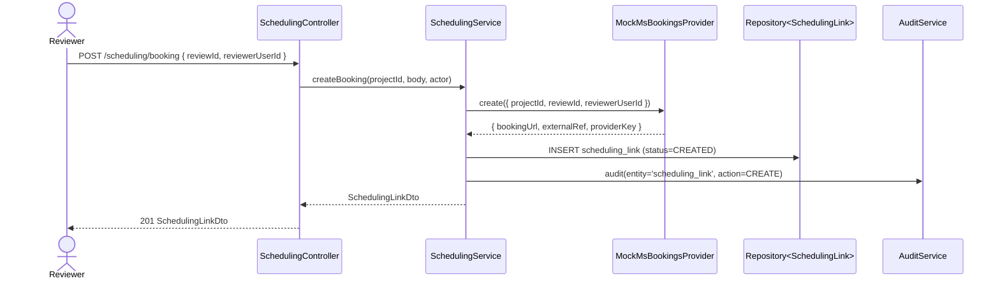
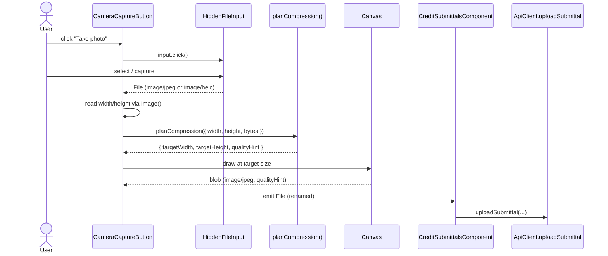

# Unit 9 — Business Logic Model

Module layout, orchestration flows, and pure subjects for Unit 9 (Mobile/PWA
& Scheduling).

---

## Module map (backend)

```
src/scheduling/
├── scheduling.module.ts
├── scheduling.service.ts            (orchestrator: provider call + persist + audit)
├── scheduling.controller.ts          (REST surface)
├── provider/
│   ├── scheduling.provider.ts        (interface + injection token)
│   └── mock-ms-bookings.provider.ts  (mock impl)
├── enums/
│   └── scheduling.enums.ts
├── scheduling-link.entity.ts
└── dto/
    ├── scheduling-link.dto.ts
    └── create-scheduling-link.dto.ts
```

`SchedulingModule` exports nothing. `app.module.ts` imports it; the new entity
is registered in `TypeOrmModule.forRoot.entities`.

## Module map (frontend)

```
src/app/features/scheduling/
├── scheduling-button.component.ts   (Schedule call CTA — used on review return)
└── scheduling.store.ts              (signal-backed; load + create)

src/app/shared/camera-capture/
└── camera-capture-button.component.ts

src/app/shared/image/
└── compression.ts                   (PURE — planCompression(input) — FL-20)
```

Also FE-wide:
- `src/manifest.webmanifest` — installable metadata.
- `src/service-worker.js` — minimal cache-first SW.
- Bootstrap in `src/main.ts` to call `navigator.serviceWorker.register(...)`.

---

## Flow 1 — Create a scheduling link (`POST /projects/:projectId/scheduling/booking`)



Text alternative:
1. Controller authorizes via `ProjectRolesGuard` + service-level Reviewer/Admin check.
2. Service calls the provider (mock impl returns a deterministic URL).
3. Persists the row, writes an audit log entry.
4. Returns the DTO.

## Flow 2 — List links (`GET /projects/:projectId/scheduling/links`)

1. Authorize: actor must be a member of `projectId` or `GlobalRole.ADMIN`.
2. Latest 10 links by `createdAt DESC`.

---

## Pure subjects

### `buildMockBookingUrl(projectId, reviewerUserId): string`

In `src/scheduling/provider/mock-ms-bookings.provider.ts` as a private pure
helper. **FL-21** subject — same inputs ⇒ same URL.

```ts
return `https://bookings.microsoft.com/usgbc-mock/${projectId}/${reviewerUserId ?? 'unassigned'}`;
```

### `planCompression(input): CompressionPlan` (frontend)

Lives in `src/app/shared/image/compression.ts`. **FL-20** PBT-01 subject.

Algorithm:
```ts
const MAX_DIM = 1600;
const { originalWidth, originalHeight, originalBytes } = input;
if (originalWidth <= MAX_DIM && originalHeight <= MAX_DIM) {
  // No resize needed; just re-encode for size reduction.
  return {
    targetWidth: originalWidth,
    targetHeight: originalHeight,
    qualityHint: originalBytes >= 1_000_000 ? 0.85 : 0.9,
  };
}
const ratio = MAX_DIM / Math.max(originalWidth, originalHeight);
return {
  targetWidth: Math.round(originalWidth * ratio),
  targetHeight: Math.round(originalHeight * ratio),
  qualityHint: 0.85,
};
```

Properties (FL-20):
1. `max(targetWidth, targetHeight) <= MAX_DIM`.
2. `min(targetWidth, targetHeight) <= min(originalWidth, originalHeight)`.
3. Aspect ratio preserved within ±1px (rounding tolerance).

---

## Camera capture flow



---

## Service-worker registration

`src/main.ts` runs:
```ts
if ('serviceWorker' in navigator && environment.production) {
  navigator.serviceWorker.register('/service-worker.js').catch(() => undefined);
}
```

`service-worker.js` content:
```js
const CACHE = 'gbci-static-v1';
self.addEventListener('install', (e) => {
  e.waitUntil(caches.open(CACHE));
  self.skipWaiting();
});
self.addEventListener('activate', (e) => {
  e.waitUntil(self.clients.claim());
});
self.addEventListener('fetch', (e) => {
  const req = e.request;
  // Never intercept API calls.
  if (req.url.includes('/api/')) return;
  if (req.method !== 'GET') return;
  e.respondWith(
    caches.match(req).then((cached) => {
      const fetchPromise = fetch(req).then((res) => {
        const copy = res.clone();
        caches.open(CACHE).then((c) => c.put(req, copy));
        return res;
      }).catch(() => cached);
      return cached || fetchPromise;
    }),
  );
});
```

The file is added to `angular.json` `assets` so it's copied to the dist root.
Same for `manifest.webmanifest`.

---

## Error handling

| Error | HTTP | Notes |
|---|---|---|
| Project not found | 404 | Standard |
| RBAC denied | 403 | Reviewer/Admin only for `POST /booking` |
| Reviewer not assigned + reviewerUserId not provided | 400 | Service infers reviewer from latest review's assigned reviewer membership |
| Provider throws | 502 | Wrapped in `BadGatewayException` (mock never throws) |
| Compressed file > MAX_BYTES (FE) | client-side guard | Surfaces a snackbar; upload skipped |
