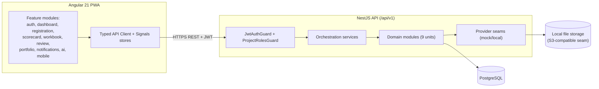

# Application Design (Consolidated) — GBCI Certify: LEED Residential

This consolidates `components.md`, `component-methods.md`, `services.md`, and
`component-dependency.md`. It is high-level (components, interfaces, services, dependencies);
detailed business logic is produced per unit in Functional Design (CONSTRUCTION).

## Design Decisions (from application-design-plan answers)
- **Q1=C Hybrid authorization**: global role (esp. Admin) + per-project membership roles (Project
  Team / Green Rater / Reviewer). Admin bypasses state-locks and has global R/W.
- **Q2=A In-process async AI** with simulated delay + status polling (no Redis).
- **Q3=A Relational LEED catalog** (rating_system, category, credit, prerequisite, point_value).
- **Q4=A Provider-interface seams** for Payment, FileStorage, Notification, AiInsight, Scheduling.
- **Q5=A REST `/api/v1`** + DTO validation + Swagger.
- **Q6=A Angular 21 PWA** — standalone components, Signals, feature-lazy routing, typed API client.
- **Q7=A Orchestration services** call domain services directly.
- **Q8=A (assumed; left blank)** — backend module + frontend feature map 1:1 to units.

## Architecture Overview



### Text Alternative
```
Angular PWA (feature modules) → typed API client → NestJS /api/v1
NestJS: Guards (auth + project role) → Orchestration → Domain modules → Provider seams
Domain → PostgreSQL; FileStorage seam → local disk (S3-compatible)
```

## Components (summary)
See `components.md`. Backend modules grouped by the 9 units (Foundation; Catalog & Scorecard;
Registration & Fees; Workbook; Review & State-Lock; Portfolio; Dashboards & Notifications; Mocked AI;
Scheduling/Mobile-PWA). Frontend mirrors these as lazy-loaded standalone feature areas.

## Methods (summary)
See `component-methods.md`. Notable pure/PBT-targeted units: `ScorecardSummaryCalculator`,
`FeeCalculator`, `BulkRegistrationParser` (round-trip), and the `StateLockService` (stateful).

## Services & Orchestration (summary)
See `services.md`. Four orchestrators encode the key cross-domain rule gates:
- Registration: project number only after pay/commit + invoice.
- Submission: preliminary-before-final, final skippable.
- Review return: results to reviewer first, then green rater.
- Portfolio submit: anchor failure cascades to children.

## Dependencies (summary)
See `component-dependency.md`. Synchronous DI between services; in-process async for AI; provider
seams isolate all external IO; DashboardModule is read-only; AuditModule is dependency-free
cross-cutting.

## Traceability to Requirements/Stories
- Hybrid RBAC → FR-11, US-11.1, US-2.6 (invite-to-project).
- Catalog/Scorecard → FR-3, US-3.x; pure calculator carries PBT invariants (NFR-4).
- Registration/Fees → FR-2, US-2.x; orchestrator enforces FR-2.5/2.7 ordering.
- Workbook → FR-4, US-4.x; Provider QC notes (renamed), storage seam.
- Review/State-lock → FR-7, US-7.x, US-11.2; phase + return-to-reviewer-first rules.
- Portfolio → FR-5, US-5.x; batch anchor cascade.
- Dashboards/Notifications → FR-10/FR-7.9, US-10.x; mock delivery.
- AI → FR-6/FR-8, US-6.1/US-8.1; in-process async, mock provider.
- Scheduling/Mobile → FR-7.6/FR-9, US-7.5/US-9.x; mock link-out, PWA.

## Open Items for Functional Design (per unit)
- Exact entity fields, relationships, and constraints.
- Scorecard certification-level thresholds and exact calculation rules.
- Fee logic formulas; bulk-upload column schema and dedupe key.
- Review phase state machine details and legal transitions.
- Mock AI finding catalog and field-verification/submittal field definitions per credit.
