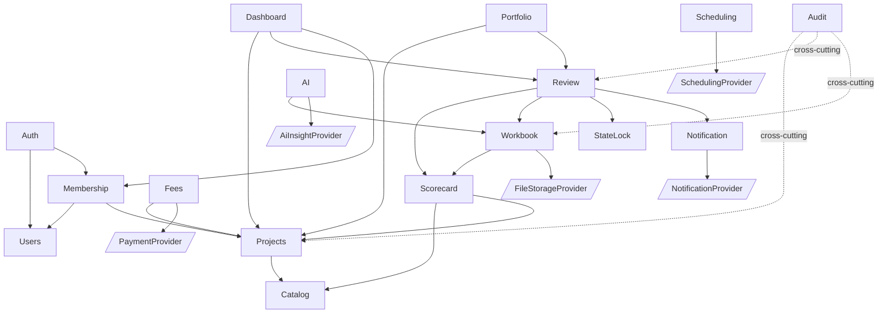

# Application Design — Component Dependencies

## Dependency Matrix (backend modules)

| Module | Depends On | Communication |
|---|---|---|
| AuthModule | UsersModule, MembershipModule, ConfigModule | in-process (DI) |
| UsersModule | AuditModule, ConfigModule | DI |
| MembershipModule | UsersModule, ProjectsModule, NotificationModule (invites) | DI |
| AuditModule | (none) | DI (interceptor/subscriber) |
| CatalogModule | (seed data) | DI |
| ScorecardModule | CatalogModule, ProjectsModule | DI |
| ProjectsModule | CatalogModule, AuditModule | DI |
| FeesModule | ProjectsModule, PaymentProvider | DI + seam |
| WorkbookModule | ScorecardModule, CatalogModule, FileStorageProvider | DI + seam |
| ReviewModule | ScorecardModule, WorkbookModule, StateLock, NotificationModule | DI |
| PortfolioModule | ProjectsModule, ReviewModule | DI |
| DashboardModule | Projects, Scorecard, Review, Membership, QualityScore | DI (read) |
| NotificationModule | NotificationProvider | DI + seam |
| AiModule | WorkbookModule, ScorecardModule, AiInsightProvider | DI + seam (async in-process) |
| SchedulingModule | SchedulingProvider | DI + seam |
| Orchestrators | the domain services they coordinate | DI |

## Communication Patterns
- **Synchronous DI calls** between services (Q7=A) — no message bus this build.
- **In-process async** for AI checks (Q2=A): a job runner with simulated delay + status polling endpoint.
- **Provider seams** abstract all external/mocked IO (Q4=A), selected by config/env.
- **REST** for all client↔server (`/api/v1`, Q5=A); **frontend** consumes via typed API client.

## Data Flow — Registration (text)
```
Client → RegistrationOrchestrator
  → ProjectsService.register (draft)
  → FeeCalculator.compute + InvoiceService.generate
  → PaymentProvider.recordIntent (pay_now|pay_later)
  → ProjectsService.assignProjectNumber (RES-#####)
  → NotificationService.notify (registration-confirmation + invoice)
→ Client (project + invoice)
```

## Data Flow — Submit & Return Review (text)
```
Submit:  Client → SubmissionOrchestrator
  → ReviewService.submitForReview (phase rules)
  → StateLockService.lock (UNDER_REVIEW)
  → NotificationService.notify (submission confirmed / assignment)

Return:  Reviewer → ReviewReturnOrchestrator
  → ReviewService finalize decisions/awards
  → ReviewReportService.autoGenerate
  → ReviewService.returnToReviewer (confirm)  ← results to reviewer FIRST
  → ReviewService.releaseToGreenRater
  → StateLockService.release
  → NotificationService.notify (review returned)
  → SchedulingProvider.createBookingLink (optional)
```

## Dependency Diagram (Mermaid)



### Text Alternative (dependencies)
```
Auth → Users, Membership
Membership → Users, Projects
Scorecard → Catalog, Projects
Projects → Catalog
Fees → Projects, [PaymentProvider]
Workbook → Scorecard, [FileStorageProvider]
Review → Scorecard, Workbook, StateLock, Notification
Portfolio → Projects, Review
Dashboard → Projects, Review, Membership
AI → Workbook, [AiInsightProvider]
Notification → [NotificationProvider]
Scheduling → [SchedulingProvider]
Audit → cross-cutting (Projects, Review, Workbook, ...)
```

## Notes on Coupling
- Seams (in brackets) are the only points touching external systems → swappable without touching domains.
- DashboardModule is read-only aggregation; it must not mutate other domains.
- AuditModule is cross-cutting and depends on nothing (avoids cycles).
