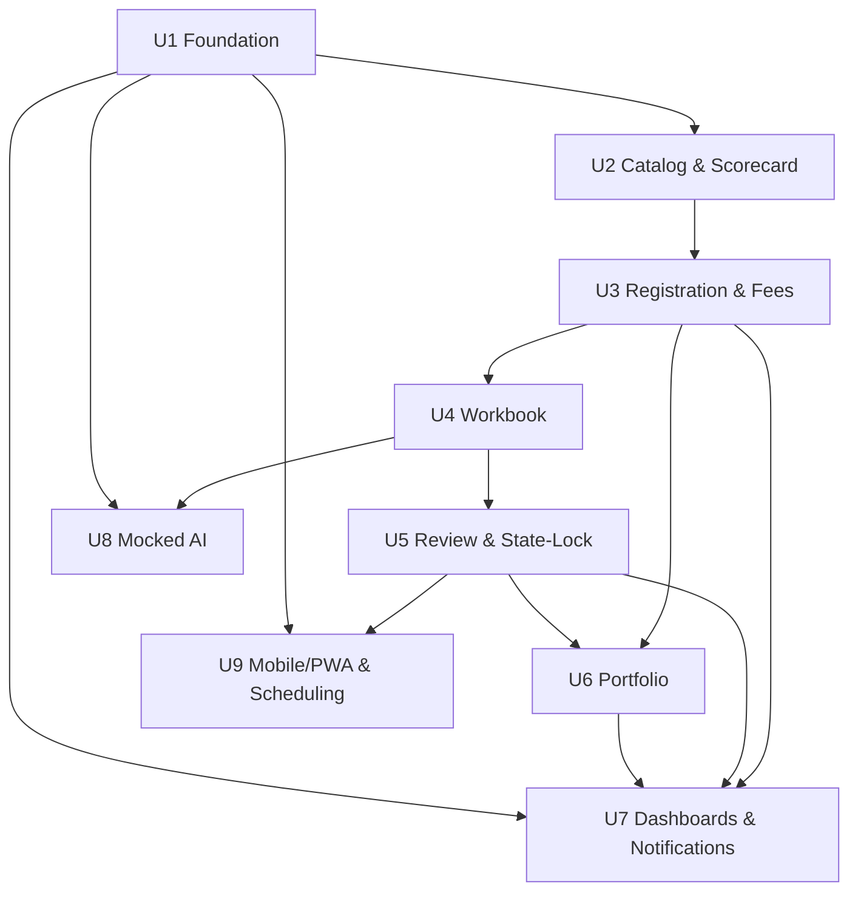

# Unit-of-Work Dependency Matrix — GBCI Certify: LEED Residential

Inter-unit communication is in-process DI within the NestJS backend (Q4=A, Q7=A). This file makes
the build-time and runtime dependencies between units explicit.

## Dependency Matrix

| Unit | Depends On | Why |
|---|---|---|
| 1 Foundation | (none) | Base for everything (RBAC, audit, demo seed) |
| 2 Catalog & Scorecard | 1 | Auth/RBAC; audit fields on entries |
| 3 Registration & Fees | 1, 2 | Membership/RBAC; project rows referenced by scorecard |
| 4 Workbook | 1, 2, 3 | RBAC; project + scorecard binding (slot auto-gen) |
| 5 Review & State-Lock | 1, 2, 3, 4 | Scorecard awards, workbook decisions, project ownership |
| 6 Portfolio | 1, 3, 5 | Self-referencing project hierarchy; batch submit reuses Review |
| 7 Dashboards & Notifications | 1, 3, 5, 6 (read aggregations) | Reads from Project/Review/Membership/Score |
| 8 Mocked AI | 1, 4 (workbook submittals + scorecard context) | Analyzes evidence; surfaced to GR/Reviewer |
| 9 Mobile/PWA & Scheduling | 1, 5 (scheduling links from review return) | Reuses auth + review; PWA touches all features |

> No circular dependencies. Build order = 1 → 2 → 3 → 4 → 5 → 6 → 7 → 8 → 9.

## Dependency Diagram (Mermaid)



### Text Alternative (dependencies)
```
U1 → U2, U7, U8, U9
U2 → U3
U3 → U4, U6, U7
U4 → U5, U8
U5 → U6, U7, U9
U6 → U7
```

## Communication Patterns
- **In-process DI** between modules within the NestJS service.
- **Orchestration services** coordinate cross-unit calls (Registration, Submission, Review-Return,
  Portfolio-Submission).
- **Provider seams** (Payment, FileStorage, Notification, AiInsight, Scheduling) are the only
  outward-facing IO points; mocked/local implementations this build.
- **Frontend ↔ Backend**: REST `/api/v1` with JWT bearer + project-role checks.
- **No message bus / no events module** (Q4=A) — fan-out is via direct calls inside orchestrators.

## Shared Resources
- **Shared types/DTOs**: `usgbc-hub-residential-be/src/shared/` and `usgbc-hub-residential-fe/src/app/shared/`.
- **Auth + ProjectRoles guards**, **Audit interceptor**: provided by Unit 1, consumed by all.
- **Provider seam interfaces**: declared centrally; mock impls live with the owning unit.
- **PostgreSQL**: a single database; each unit owns a logical sub-schema (its tables).
- **Local file storage** (S3-compatible API): owned by Unit 4; consumed via the storage seam.

## Integration Strategy
- **Per-unit testing** at unit boundary (services + controllers + PBT properties identified during
  Functional Design).
- **Cross-unit testing** at orchestration seams (Registration, Submission, Review-Return,
  Portfolio-Submission) — verified during Build & Test.
- **Coordination points**: project status transitions (drafted → registered → in_workbook → under_review →
  returned → certified | continued) are owned by Project + State-Lock services and referenced by Review,
  Portfolio, Dashboard.

## Risk / Rollback per Unit
- Risk and rollback are **Easy** for all units this build (local-only, version-controlled, no cloud).
- Rollback strategy: revert the unit's commits; database `synchronize=true` drops/re-creates the
  unit's tables in dev. Migration discipline is out of scope this build (NFR-6).
