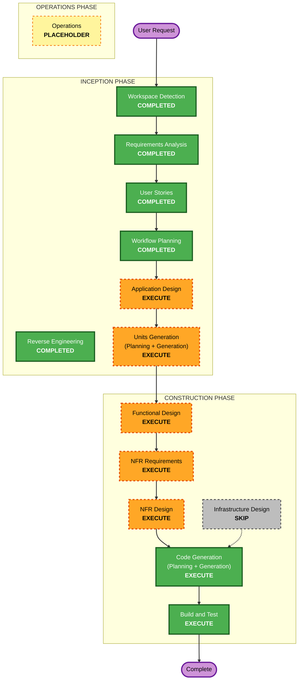

# Execution Plan — GBCI Certify: LEED Residential

## Detailed Analysis Summary

### Transformation Scope (Brownfield)
- **Transformation Type**: Architectural expansion. The existing prototype is an auth/RBAC-only
  NestJS backend; this build restructures it (Q3=B) to match the Technical Design and adds the full
  certification domain plus a new Angular 21 PWA frontend.
- **Primary Changes**: New backend domain modules (projects/registration, scorecard/catalog,
  workbook, portfolio, review workflow, notifications, storage seam, mocked AI seam, dashboards,
  fees), expanded RBAC to four roles, audit + state-locking; brand-new frontend application.
- **Related Components**: Existing `auth`/`users` modules (reworked to four roles), Docker Compose
  Postgres (local), seed data (LEED v4.1 SF catalog + demo accounts).

### Change Impact Assessment
- **User-facing changes**: Yes — entire product UI and workflows are new (4 role-tailored experiences).
- **Structural changes**: Yes — new modular backend domains + new frontend app; auth restructured.
- **Data model changes**: Yes — projects, rating-system/catalog, scorecard entries, workbook
  (field verification/submittals/notes), portfolio hierarchy, reviews, scores, invoices, audit fields.
- **API changes**: Yes — many new REST endpoints; existing auth endpoints reworked for four roles.
- **NFR impact**: Yes — async (mocked) AI processing, file storage abstraction, state-locking,
  audit trails, mobile/PWA, PBT (full enforcement). Security/resiliency baselines OFF.

### Component Relationships (Brownfield)
- **Primary Component**: `usgbc-hub-residential-be` (restructured + extended).
- **New Component**: `usgbc-hub-residential-fe` (Angular 21 PWA).
- **Shared/Supporting**: PostgreSQL (Docker Compose, local), local file storage (S3-compatible seam),
  seed data, structured logging (existing), notification + AI provider seams (new, mocked).
- **Dependent Components**: Frontend depends on backend API contracts; review workflow depends on
  scorecard/workbook; portfolio depends on projects; dashboards depend on all domains.

### Risk Assessment
- **Risk Level**: High (system-wide, multi-component, large new surface area).
- **Rollback Complexity**: Easy (local-only, version-controlled, no cloud/production resources).
- **Testing Complexity**: Complex (PBT fully enforced + multi-component integration; backend + PWA).

## Workflow Visualization



### Text Alternative (workflow)
```
INCEPTION
- Workspace Detection ....... COMPLETED
- Reverse Engineering ....... COMPLETED
- Requirements Analysis ..... COMPLETED
- User Stories .............. COMPLETED
- Workflow Planning ......... COMPLETED (this document)
- Application Design ........ EXECUTE
- Units Generation .......... EXECUTE

CONSTRUCTION (per-unit loop, then build/test)
- Functional Design ......... EXECUTE (per unit)
- NFR Requirements .......... EXECUTE (per unit)
- NFR Design ................ EXECUTE (per unit)
- Infrastructure Design ..... SKIP (local-only; no cloud/IaC)
- Code Generation ........... EXECUTE (per unit)
- Build and Test ............ EXECUTE (after all units)

OPERATIONS
- Operations ................ PLACEHOLDER
```

## Phases to Execute

### 🔵 INCEPTION PHASE
- [x] Workspace Detection (COMPLETED)
- [x] Reverse Engineering (COMPLETED)
- [x] Requirements Analysis (COMPLETED)
- [x] User Stories (COMPLETED)
- [x] Execution Plan (IN PROGRESS → COMPLETED on approval)
- [ ] Application Design — **EXECUTE**
  - **Rationale**: Many new components/services (registration, catalog/scorecard, workbook, portfolio,
    review workflow, notifications, storage seam, AI seam, dashboards, fees) and the four-role service
    layer must be defined, with cross-component dependencies and API contracts for the frontend.
- [ ] Units Generation — **EXECUTE**
  - **Rationale**: The system must be decomposed into multiple units of work (backend domains + frontend)
    to manage complexity and enable a sensible build sequence.

### 🟢 CONSTRUCTION PHASE (per-unit loop)
- [ ] Functional Design — **EXECUTE** (per unit)
  - **Rationale**: New data models and complex business logic (scorecard math, certification-level
    thresholds, fee logic, review state machine, portfolio hierarchy, bulk-upload parsing). Also where
    PBT testable properties are identified (PBT-01).
- [ ] NFR Requirements — **EXECUTE** (per unit)
  - **Rationale**: Tech-stack confirmation (NestJS, Angular 21, PostgreSQL, fast-check), async AI
    processing, mobile/PWA, storage abstraction; PBT framework selection (PBT-09).
- [ ] NFR Design — **EXECUTE** (per unit)
  - **Rationale**: Incorporate patterns for state-locking, audit trails, async (mocked) processing,
    storage/notification/AI seams, and PWA/mobile concerns.
- [ ] Infrastructure Design — **SKIP**
  - **Rationale**: Local-only this build (Q7=A) — no cloud provisioning or IaC. The minimal local
    runtime (Docker Compose Postgres + local file storage) is handled in Code Generation and
    Build & Test. Security/resiliency baseline extensions are OFF.
- [ ] Code Generation — **EXECUTE** (ALWAYS, per unit)
  - **Rationale**: Implementation planning and code generation for each unit, with PBT + example tests.
- [ ] Build and Test — **EXECUTE** (ALWAYS)
  - **Rationale**: Build all units; run unit/integration/PBT suites with seed logging; verify end-to-end.

### 🟡 OPERATIONS PHASE
- [ ] Operations — PLACEHOLDER
  - **Rationale**: Future deployment/monitoring; out of scope this build.

## Proposed Unit Build Sequence (refined in Units Generation)
Derived from the user-story Build Order (foundational → dependent):
1. **Platform Foundation** — four-role RBAC, auth rework, audit trails, demo seed (US-11.1, US-11.3, US-1.x).
2. **LEED Catalog & Scorecard** — rating-system/catalog data, scorecard view & point entry, live summary (US-3.x).
3. **Project Registration & Fees** — registration, payment/commitment + invoice, project number, bulk upload, invites (US-2.x).
4. **Workbook** — scorecard↔workbook binding, field verification, submittals (storage seam), Provider QC notes (US-4.x).
5. **Review Workflow & State-Locking** — phases, submit, decisions/awards, auto-report, accept/continue, scores, state-lock (US-7.x, US-11.2).
6. **Portfolio** — anchor designation, portfolio dashboard, batch submit with anchor cascade (US-5.x, US-7.2).
7. **Dashboards & Notifications** — four role dashboards, admin pipeline/assignment, mocked notifications (US-10.x, US-7.8).
8. **Mocked AI** — completeness/consistency + reviewer pre-review behind the AI seam (US-6.1, US-8.1).
9. **Mobile/PWA polish** — responsive layouts, camera upload, client-side compression, MS Bookings link-out (US-9.x, US-7.5).

> Note: backend and frontend slices within each unit are coordinated; exact unit boundaries and
> dependencies are finalized in Units Generation.

## Estimated Timeline
- **Total Phases (this plan)**: 4 remaining INCEPTION/CONSTRUCTION design stages + per-unit code gen + build/test.
- **Estimated Duration**: Multi-iteration; ~9 units each cycling through design + code generation.
  (AI-DLC is checkpoint-driven, not time-boxed; each unit is approved before the next.)

## Success Criteria
- **Primary Goal**: A local-runnable, demo-ready foundation covering all initial-build feature areas
  with production-quality structure and mocked/deferred external seams.
- **Key Deliverables**: Restructured NestJS backend with domain modules; Angular 21 PWA; real LEED
  v4.1 SF catalog; four-role RBAC; review workflow with state-locking; mocked AI/notifications/storage;
  PBT + example test suites.
- **Quality Gates**: PBT compliance per applicable stage (full enforcement); example-based tests for
  business-critical paths; lint/format clean; backend builds and frontend builds; integration passes.
- **Integration Testing**: Backend + frontend working together against seeded demo data.
- **Operational Readiness**: Local Docker Compose up; demo accounts and data seeded; mocked AI returns
  realistic insights for presentations.
