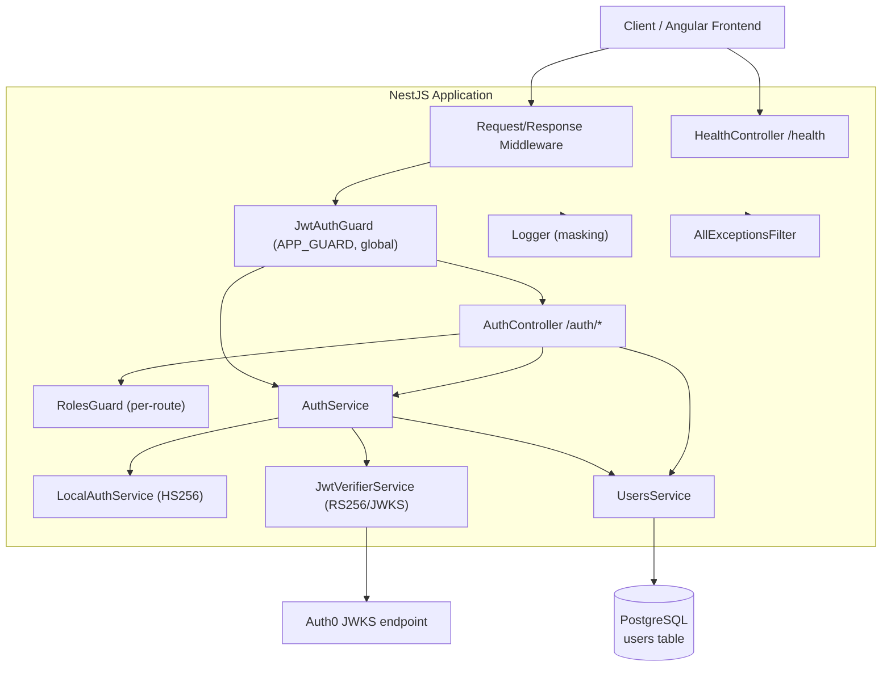
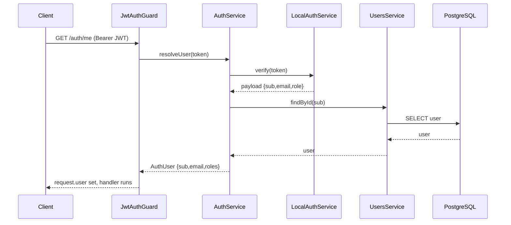
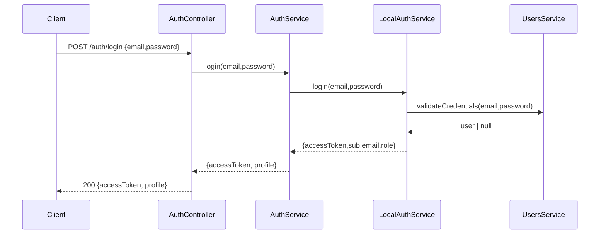

# System Architecture

## System Overview

A standalone NestJS (v9) backend written in TypeScript, running on Node.js 20.13.1. It exposes a
REST API secured by a global authentication guard, with role-based authorization. Identity can be
verified in three modes: **local** (app-signed HS256 JWT over email/password), **auth0** (RS256
JWKS verification), and **mock** (stub identity for demos). User records and role assignments are
persisted in PostgreSQL via TypeORM. The app is self-contained — no external shared libraries — and
intended to run locally (Docker Compose Postgres).

## Architecture Diagram

## Component Descriptions

### AuthModule
- **Purpose**: Authentication and authorization.
- **Responsibilities**: Login, token verification, profile/permissions, admin user management.
- **Dependencies**: UsersModule, ConfigModule, Logger.
- **Type**: Application.

### UsersModule
- **Purpose**: User persistence and role management.
- **Responsibilities**: TypeORM repository access, credential validation, seeding, role assignment.
- **Dependencies**: TypeOrmModule (User entity), ConfigModule, Logger.
- **Type**: Application.

### CommonModule (logger/middleware/exception)
- **Purpose**: Cross-cutting concerns.
- **Responsibilities**: Logging with masking, request/response middleware, global exception filter.
- **Dependencies**: ConfigModule.
- **Type**: Application/Infrastructure.

### ConfigModule (configuration.ts)
- **Purpose**: Validated environment configuration.
- **Responsibilities**: Fail-fast validation, auth/db/seed config shaping.
- **Type**: Application/Infrastructure.

### HealthController
- **Purpose**: Liveness check.
- **Type**: Application.

## Data Flow

### Authenticated request (local provider)

### Login

## Integration Points

- **External APIs**: Auth0 JWKS endpoint (`AUTH0_JWKS_URI`) — only in `auth0` provider mode.
- **Databases**: PostgreSQL (`users` table) via TypeORM.
- **Third-party Services**: Auth0 / USGBC IdP (QAS tenant) for token issuance in auth0 mode.

## Infrastructure Components

- **CDK Stacks**: None (no IaC present).
- **Deployment Model**: Local only. `docker-compose.yml` provides PostgreSQL; app run via `nest start`.
- **Networking**: CORS restricted to `FRONTEND_ORIGIN`; Helmet security headers (relaxed for local).
- **Schema management**: TypeORM `synchronize=true` for local (no migrations).
