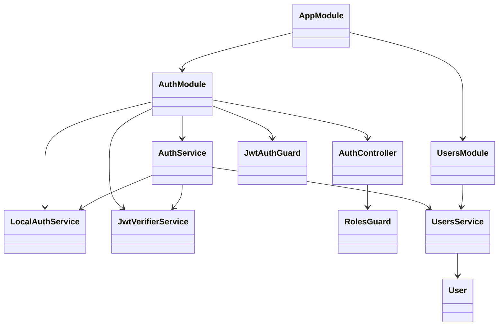

# Code Structure

## Build System
- **Type**: npm + NestJS CLI (`nest build`, `nest start`).
- **Configuration**: `package.json` (scripts, deps), `nest-cli.json`, `tsconfig*.json`,
  `.eslintrc.js`, `.prettierrc`, `docker-compose.yml` (Postgres), `.env` / `.env.example`.
- **Runtime**: Node.js 20.13.1, TypeScript ~4.7.4.

## Key Modules

## Existing Files Inventory

- `src/main.ts` — Bootstrap: Helmet, CORS, global ValidationPipe, exception filter, Swagger, listen.
- `src/app.module.ts` — Root module: config, TypeORM (async), Auth/Users modules, middleware wiring.
- `src/config/configuration.ts` — Fail-fast env config loader; auth/db/seed shaping; SEED_USERS parser.
- `src/config/swagger/swagger.config.ts` — Swagger/OpenAPI setup.
- `src/auth/auth.controller.ts` — Routes: login, me, role, create user, update role.
- `src/auth/auth.service.ts` — Orchestrates login + token resolution across local/auth0/mock; profile.
- `src/auth/auth.module.ts` — Wires auth providers; registers global `JwtAuthGuard` via APP_GUARD.
- `src/auth/local/local-auth.service.ts` — Local login + HS256 JWT sign/verify.
- `src/auth/verifier/jwt-verifier.service.ts` — Auth0 RS256 verification via JWKS.
- `src/auth/guards/jwt-auth.guard.ts` — Global authentication guard (honors `@Public`).
- `src/auth/guards/roles.guard.ts` — Role-based authorization (honors `@Roles`).
- `src/auth/decorators/current-user.decorator.ts` — Injects `request.user`.
- `src/auth/decorators/public.decorator.ts` — Marks routes public.
- `src/auth/decorators/roles.decorator.ts` — Declares required roles.
- `src/auth/enums/role.enum.ts` — `Role` enum, labels, `isRole`.
- `src/auth/enums/permission.enum.ts` — `Permission` enum, role→permission map, `getPermissionsForRoles`.
- `src/auth/interfaces/auth-user.interface.ts` — `AuthUser`, `VerifiedClaims`.
- `src/auth/dto/*.ts` — `LoginDto`, `CreateUserDto`, `UpdateRoleDto`, `ProfileDto`.
- `src/users/user.entity.ts` — `User` TypeORM entity (uuid id, auth0Sub, email, passwordHash, role, timestamps).
- `src/users/users.service.ts` — Persistence, credential validation, seeding, find-or-create, set role.
- `src/users/users.module.ts` — Registers User repository + UsersService.
- `src/common/logger/*` — Logger service, module, masking util.
- `src/common/middleware/*` — Request and response middleware.
- `src/common/exception/all-exceptions.filter.ts` — Global exception filter.
- `src/health/health.controller.ts` — Public `/health` endpoint.
- `scripts/init-db.js` — Helper to create Postgres role/db from DB_* env.

## Design Patterns

### Global Guard (APP_GUARD)
- **Location**: `auth.module.ts` registers `JwtAuthGuard` globally.
- **Purpose**: Secure-by-default — every route requires auth unless `@Public()`.
- **Implementation**: NestJS `APP_GUARD` provider + reflector metadata.

### Decorator-driven authorization
- **Location**: `@Roles()` + `RolesGuard`, `@Public()` + `JwtAuthGuard`, `@CurrentUser()`.
- **Purpose**: Declarative access control and request-user injection.

### Strategy by configuration (auth provider)
- **Location**: `AuthService.resolveUser` branches on mock/local/auth0.
- **Purpose**: Swap identity verification without changing call sites.

### Repository + Service layering
- **Location**: `UsersService` over TypeORM `Repository<User>`.
- **Purpose**: Encapsulate persistence; controllers/services never touch the repo directly.

### Fail-fast configuration
- **Location**: `configuration.ts` throws on missing required env vars.

## Critical Dependencies

### @nestjs/* (v9)
- **Usage**: Core framework, config, swagger, typeorm integration.

### typeorm + pg
- **Version**: typeorm ^0.3.17, pg ^8.11.3.
- **Usage**: Postgres persistence of `users`.

### jsonwebtoken + jwks-rsa
- **Usage**: HS256 local token sign/verify; RS256 Auth0 verification via JWKS.

### bcryptjs
- **Usage**: Password hashing (10 rounds) and comparison.

### class-validator + class-transformer
- **Usage**: DTO validation via global ValidationPipe (whitelist + forbidNonWhitelisted).

### helmet
- **Usage**: Security headers.
