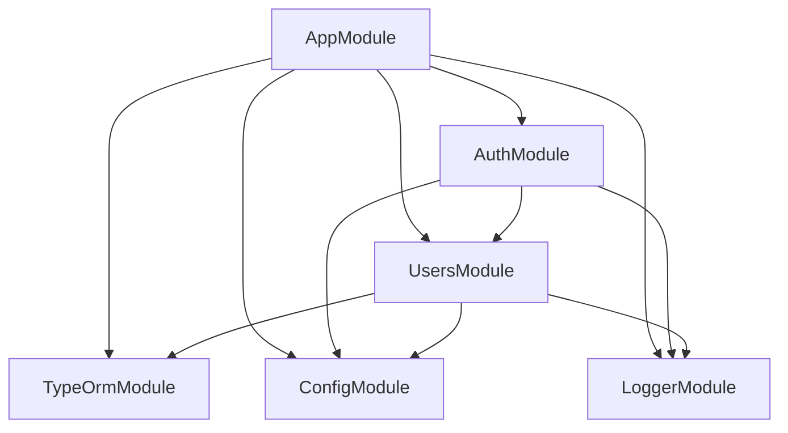

# Dependencies

## Internal Dependencies

### AuthModule depends on UsersModule
- **Type**: Runtime.
- **Reason**: Resolve/persist users and roles during login and token resolution.

### AuthModule depends on ConfigModule
- **Type**: Runtime.
- **Reason**: Read auth provider, mock settings, JWKS/local JWT config.

### UsersModule depends on TypeOrmModule (User)
- **Type**: Runtime.
- **Reason**: Repository access to the `users` table.

### All modules depend on LoggerModule
- **Type**: Runtime.
- **Reason**: Structured logging with secret masking.

## External Dependencies

### @nestjs/common, @nestjs/core, @nestjs/platform-express
- **Version**: ^9.4.3 — **Purpose**: Application framework. — **License**: MIT.

### @nestjs/typeorm + typeorm + pg
- **Version**: ^9.0.1 / ^0.3.17 / ^8.11.3 — **Purpose**: Postgres ORM persistence. — **License**: MIT.

### jsonwebtoken
- **Version**: ^9.0.2 — **Purpose**: Local HS256 JWT sign/verify. — **License**: MIT.

### jwks-rsa
- **Version**: ^3.0.1 — **Purpose**: Auth0 RS256 signing-key resolution. — **License**: MIT.

### bcryptjs
- **Version**: ^3.0.3 — **Purpose**: Password hashing. — **License**: MIT.

### helmet
- **Version**: ^7.0.0 — **Purpose**: HTTP security headers. — **License**: MIT.

### class-validator + class-transformer
- **Version**: ^0.14.0 / ^0.5.1 — **Purpose**: DTO validation/transformation. — **License**: MIT.

### @nestjs/swagger
- **Version**: ^6.3.0 — **Purpose**: OpenAPI docs. — **License**: MIT.

### dotenv
- **Version**: ^16.3.1 — **Purpose**: Env loading. — **License**: BSD-2-Clause.
